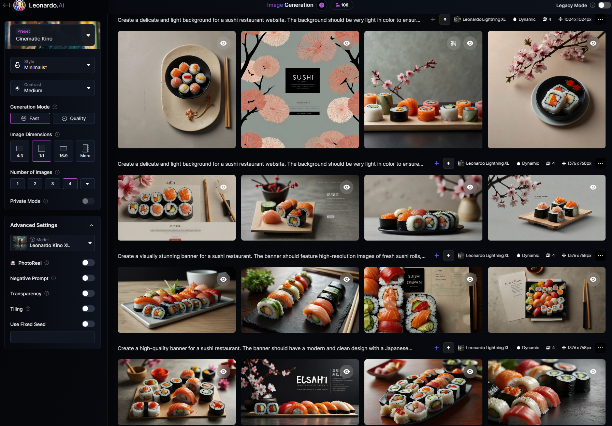

# Projekt wykorzystujący z AI

### Przykładowa strona sklepu z sushi.


Przy budowie strony pomagał mi ChatGPT. 

<p align="center">
  
</p>


Strona jest responsywna

<p align="center">
  
</p>

Okienko czatu jest spięte z OpenIA i pomaga w wyborze dania.

<p align="center">
  
</p>


Grafiki na banery, ikony, kafelki, wygenerował mi Leonardo.ai

<p align="center" float="top">
  
  
</p>


## Zastosowane języki i technologie

React + TypeScript + Vite

<p align="center">
  <a href="https://reactjs.org/" target="_blank" rel="noreferrer"> 
  </a> 
  <a href="https://vitejs.dev/" target="_blank" rel="noreferrer"> 
  </a> 
</p>
<p align="center">
  <a href="https://openai.com/" target="_blank" rel="noreferrer">  
  </a> 
  <a href="https://www.w3.org/html/" target="_blank" rel="noreferrer">  
  </a> 
  <a href="https://www.w3schools.com/css/" target="_blank" rel="noreferrer">
   
  </a> 
  <a href="https://developer.mozilla.org/en-US/docs/Web/JavaScript" target="_blank" rel="noreferrer"> 
  </a> 
  <a href="https://www.typescriptlang.org/" target="_blank" rel="noreferrer"> 
  </a> 
  <a href="https://git-scm.com/" target="_blank" rel="noreferrer">  
  </a>
  <a href="https://github.com/" target="_blank" rel="noreferrer">  
  </a> 
</p>


#### Uruchomienie projektu na swojej lokanej maszynie

Sklonuj repozytorium na swój dysk

```bash
git clone https://github.com/Keszua/megak-game-over-front.git
```

Wejdz do folderu *project* i pobierz wymagane zależnosci

```bash
cd project
yarn
```

Uruchomienie projektu

```bash
yarn dev
```


<hr/>

## Kontakt

Mój profil na <a href="https://www.linkedin.com/in/karol-michalczyk-keszua83/" target="_blank" rel="noreferrer">  
</a>

#### mail: [Gmail](mailto:keszua@gmail.com)

<hr/>
